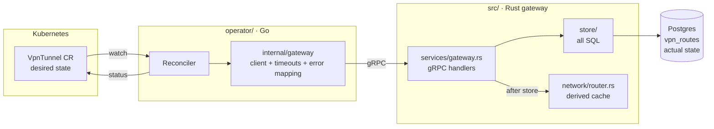
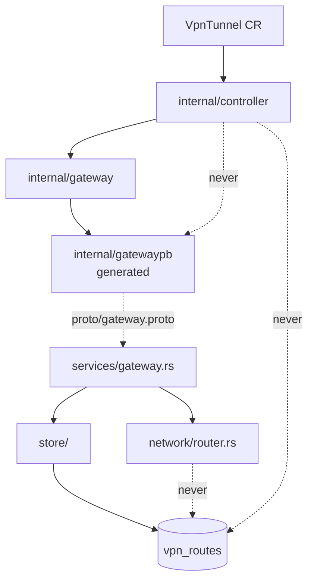
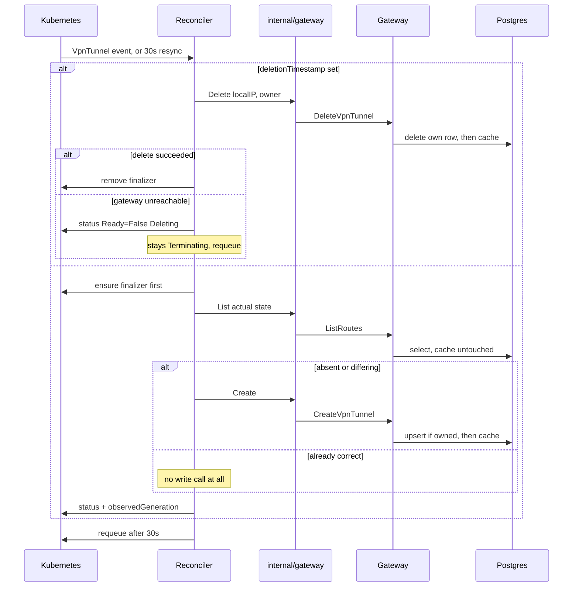

# Architecture Spine — grpc_network_gateway control plane

## Design Paradigm

**Level-triggered reconciliation.** A Go reconciler converges a declarative desired state onto a
data-plane service through an idempotent gRPC API. Three state locations, and they are not
interchangeable:

| State | Lives in | Read by |
| --- | --- | --- |
| **Desired** | `VpnTunnel` resources in Kubernetes | the operator |
| **Actual** | the `vpn_routes` table, via `ListRoutes` | the operator |
| **Derived cache** | each gateway pod's in-memory routing table | that pod's `RoutePacket` and `GetGatewayStatus` only |

The paradigm carries three rules downstream without restating them: every write is safe to repeat,
every pass converges from whatever it finds rather than from what it expected, and nothing observed
about the gateway survives a pass.



## Where This Contradicts Its Inputs

Five decisions here deliberately override something an input says. They are listed because the
inputs remain in the repository and will be read by whoever builds next.

| Input | What it says | What governs instead |
| --- | --- | --- |
| PRD §6 | The permanent cgroup host fix is "deliberately deferred" | **AD-11** — it is now a prerequisite task owned by E5a |
| PRD §6, `AGENTS.md` | Kubernetes **1.36+** refuses cgroup v1 | Factually wrong: the cutover is **1.35** (KEP-5573). v1.35.8 would also have failed |
| `AGENTS.md` | "Use the `log` crate — never `tracing`", "no new `println!`" | **AD-9** — `log` is not a dependency, `tracing` is, and every shipped line is a `println!`. All three clauses are false today |
| `AGENTS.md` | "Leave the kind node image pinned at `v1.33.1`" | **AD-11** — retired once the host fix lands |
| PRD FR-1, FR-2 (`Delivered — no story`) | Current error codes are settled | **AD-3** — E1 reopens both handlers to unify the taxonomy |

`AGENTS.md` must be refreshed when E1 lands; three of its rules are wrong today.

## Invariants & Rules

### AD-1 — The durable record is the only authority; the routing table is a derived cache

- **Binds:** FR-1, FR-2, FR-3, FR-4, FR-31, FR-32, hydration
- **Prevents:** a builder treating in-memory state as truth, or the operator reading a pod-local
  view and seeing total drift.
- **Rule:** `vpn_routes` is the sole authority for whether a Tunnel exists. The routing table is a
  per-pod cache derived from it. Every control-plane read comes from the store; every write
  persists before it caches. `GetGatewayStatus` reads the cache and is a debugging and
  demonstration surface only — it must never be substituted for `ListRoutes`.

### AD-2 — All SQL lives in `src/store/`; handlers orchestrate store then cache

- **Binds:** FR-1, FR-2, FR-3, FR-31, hydration, every future RPC
- **Prevents:** write ordering being re-decided by whoever adds the next RPC, which is what makes
  FR-31 a defect rather than a typo today.
- **Rule:** no SQL reaches Postgres from outside `src/store/` — this covers `sqlx::query!`, the
  function form `sqlx::query`, and anything else. The readiness probe's `SELECT 1`
  (`src/services/health.rs:59`) moves there as `store::ping()`. A handler may call the store and
  then the cache; never the reverse. `network/router.rs` has no database knowledge and gains none.

### AD-3 — One failure taxonomy, mapped at the store boundary, classified once per side

- **Binds:** FR-1, FR-2, FR-3, FR-19, FR-20, FR-21
- **Prevents:** the same failure (Postgres unreachable) returning `INTERNAL` from one RPC and
  `UNAVAILABLE` from another, and retry policy scattering through the reconcile path.
- **Rule:** Rust maps at the store boundary, into three classes:
  - **Retryable** — connectivity or pool error to `UNAVAILABLE`; genuinely unexpected to `INTERNAL`.
  - **Permanent** — invalid input to `INVALID_ARGUMENT`, raised before any write; **and any Postgres
    constraint violation** (length, type, check) to `INVALID_ARGUMENT`, never `INTERNAL`. See AD-15.
  - **Conflict** — a row owned by another `VpnTunnel` to `FAILED_PRECONDITION`. See AD-13.

  Go classifies only in `operator/internal/gateway`: permanent and conflict go to the `Ready`
  condition without retry; retryable returns the error and requeues under `controller-runtime`
  backoff. An error is never rendered as an empty result.

### AD-4 — `proto/gateway.proto` and `.sqlx/` are generated artefacts that move in the same commit as their source

- **Binds:** FR-3, FR-9, FR-24, FR-25 · E1, E2, E3
- **Prevents:** two programs drifting on one API, and the offline build compiling against stale
  query metadata after E1 relocates every query.
- **Rule:** Rust generates protobuf into `OUT_DIR` at build time, unchanged. Go generates into a
  **committed** `operator/internal/gatewaypb/` via `make proto`. `.sqlx/` is committed and
  regenerated with `make prepare`. Any edit to a `.proto` file or to any SQL regenerates the
  corresponding artefact **in the same commit**. `go build` and `go test` must never require
  `protoc`. `make check` enforces this locally — it runs the generators and fails on
  `git diff --exit-code`, so the rule does not depend on CI, which is deferred.

### AD-5 — The reconciler depends on `internal/gateway`, never on gRPC

- **Binds:** FR-16, FR-19, FR-20, FR-21, FR-24, FR-25
- **Prevents:** dialing, timeouts and status-code classification spreading through `Reconcile`, and
  FR-16's "no write call, verified by call count" being untestable under `envtest`.
- **Rule:** `operator/internal/gateway` exports an interface — list, create, delete — and is the only
  package that dials, applies the FR-21 per-call timeout, or inspects a gRPC status code.
  `operator/internal/controller` must not import `google.golang.org/grpc`. Tests inject a counting
  fake implementation.

### AD-6 — Nothing gateway-derived survives a pass; transport is not state

- **Binds:** FR-16, FR-17, FR-21, FR-32
- **Prevents:** both failure modes of FR-32 — caching observed routes between passes, and the
  over-reading that redials a fresh connection every resync.
- **Rule:** no gateway-derived data lives in a struct field, package variable or cache that outlives
  one `Reconcile` call. A `grpc.ClientConn` is transport, not state: connections are created with
  `grpc.NewClient` (never `grpc.Dial` with `WithBlock`, which would make operator startup depend on
  gateway availability), cached per `gatewayRef` for the process lifetime, and reused.

### AD-7 — One-way dependency; the operator never touches Postgres

- **Binds:** all
- **Prevents:** the shortcut where the operator reads `vpn_routes` directly and stops being a client
  of the API it is supposed to prove.
- **Rule:** the operator's only channel to tunnel state is the gateway's gRPC API. The gateway never
  reads the Kubernetes API and has no knowledge that an operator exists. Dependencies run one way
  only, and no arrow may be added in reverse.



Dotted arrows are prohibitions, not dependencies: the reconciler reaches neither the database nor
the generated stubs, and the cache never reads the database on its own behalf — only `store/` does,
on behalf of a handler or of hydration.

### AD-8 — The Makefile is the interface; Helm is the mechanism; CRDs are applied outside Helm

- **Binds:** FR-10, FR-12, FR-23, FR-28 · SM-2
- **Prevents:** two documented ways to deploy one system, and a CRD change silently never reaching
  the cluster — `helm upgrade` does not update resources in `crds/`, only `helm install` creates them.
- **Rule:** `make deploy` applies the CRD with `kubectl apply -f charts/netgw/crds/` **first**, then
  runs `helm upgrade --install`. The README quickstart uses `make` targets only. `k8s/` becomes the
  chart's templates and the directory is removed when FR-12 lands. The chart is `apiVersion: v2`.

### AD-9 — Both programs log structurally

- **Binds:** all · FR-26
- **Prevents:** half the system emitting structured context and half emitting `println!`, which is
  the state today.
- **Rule:** Rust uses `tracing` with `tracing-subscriber`; no `println!` survives E1. Go uses `logr`
  through `controller-runtime`. Gateway lines carry the `local_ip` they concern and, on failure, the
  gRPC code; operator lines carry the resource's namespace and name.

### AD-10 — `gatewayRef` resolves by DNS, never by an API read; the port is a constant

- **Binds:** FR-13, FR-21, FR-22
- **Prevents:** the operator acquiring RBAC on Services, a second DNS construction appearing later,
  and three stories each inventing where the port comes from.
- **Rule:** `gatewayRef` carries name and namespace only, and both are used verbatim to build
  `<name>.<namespace>.svc.cluster.local:50051`. The port is a package constant in
  `internal/gateway`, matching the Service port — it is **not** a `gatewayRef` field and not a
  per-resource value. Any namespace is permitted. The operator never reads the Service object, so
  its RBAC covers `vpntunnels`, `vpntunnels/status` and events only.

### AD-11 — The operational envelope is fixed and registry-free — and the host fix is a prerequisite, not a fact

- **Binds:** FR-9, FR-10, FR-11, FR-12, FR-23 · SM-2
- **Prevents:** a story assuming a registry, a second cluster, or a port reachable beyond loopback —
  and a builder pinning v1.37.0 on an unprepared host and watching `make cluster-up` hang.
- **Rule:**
  - **Prerequisite, owned by E5a, and not yet done.** This host still mounts the legacy hybrid
    hierarchy — verified 2026-09-20: `/sys/fs/cgroup/cgroup.controllers` absent, 16 v1 controllers
    mounted, no `cgroup_no_v1` in `/proc/cmdline`, and `kind/cluster.yaml` still pins `v1.33.1` by
    tag. Until `kernelCommandLine = cgroup_no_v1=all` is added to `.wslconfig` and `wsl --shutdown`
    has run, **v1.37.0 will not boot.** This overrides PRD §6, which deferred the fix.
  - **After the fix**, the node image is `kindest/node:v1.37.0` pinned **by digest**, matching
    kubectl v1.37.0. Before it, the only kind v0.33.0 prebuilt that boots on cgroup v1 is
    `v1.34.11` — the cutover is Kubernetes **1.35**, not 1.36 as PRD §6 states.
  - One kind cluster, `netgw`, single node. Both images built locally and side-loaded with
    `kind load docker-image`; `imagePullPolicy: IfNotPresent`; nothing is pulled from a registry.
  - Every published port binds `127.0.0.1` explicitly.
  - Gateway `replicas: 1`; operator `replicas: 1` — the operator's leader-election deferral
    (PRD §8.2) is only safe at one replica, so a second requires election first.
  - The operator watches **cluster-wide**, so a `ClusterRole` over `vpntunnels`,
    `vpntunnels/status` and events. A namespace-scoped watch would make AD-10's any-namespace
    permission unreachable.
  - Both pods carry the FR-11 posture: non-root with an explicit uid, all capabilities dropped, no
    privilege escalation, `RuntimeDefault` seccomp, read-only root filesystem.
  - **Everything must fit under 4 GB** (PRD §5; this host has 3.8 GB, ~0.8 GB free). The Go
    toolchain, a second image, the operator pod, `envtest` and `testcontainers-go` all land against
    that ceiling. Stop `rust-analyzer` before creating a cluster.

### AD-12 — `ListRoutes` returns a dedicated message, and equality is over named fields

- **Binds:** FR-3, FR-16, FR-32
- **Prevents:** the Rust builder returning the shipped `RouteDetails` (keyed `destination_ip`, and
  tempting to extend with `created_at` or `owner` since the table is the authority) while the Go
  builder compares whole messages — which makes every pass a write and fails FR-16's call-count
  assertion outright.
- **Rule:** `ListRoutes` returns `repeated Route`, a **new** message with exactly four fields:
  `local_ip`, `tunnel_id`, `remote_endpoint`, `owner`. It is keyed `local_ip`, not
  `destination_ip`; the shipped `RouteDetails` is left alone, because it belongs to
  `GetGatewayStatus`, which is a different surface (AD-1). Columns that exist for bookkeeping —
  `id`, `created_at` — are **not** on the wire. "Already correct" means `owner` equals the caller's
  `<namespace>/<name>` **and** `tunnel_id` and `remote_endpoint` equal the spec, by exact string
  comparison. A row whose values match but whose `owner` differs is a conflict (AD-13), not
  convergence. *(Amended 2026-10-07, Epic 1 retro F-5: `owner` was off the wire until then. On a
  caller's own rows `owner` always equals the caller, so it can never make a correct Tunnel look
  like drift; `id` and `created_at` can, which is why they stay off.)*

### AD-13 — Every row has one owner; deletes are owner-scoped

- **Binds:** FR-1, FR-2, FR-3, FR-13, FR-18, FR-31 · SM-5
- **Prevents:** two `VpnTunnel` resources declaring the same `localIP` upserting over each other
  forever while both report `Ready/Converged` — and, worse, a delete in one namespace issuing an
  unconditional `DELETE ... WHERE local_ip = $1` that destroys the other namespace's tunnel.
- **Rule:** `vpn_routes` gains an `owner` column holding `<namespace>/<name>` of the owning
  `VpnTunnel`; `TunnelRequest` and `DeleteTunnelRequest` carry it. `CreateVpnTunnel` claims an
  unowned row or updates its own, and returns `FAILED_PRECONDITION` when a different owner holds it.
  `DeleteVpnTunnel` removes only a row it owns, and still returns `success=true, existed=false`
  when there is nothing of its own to delete — FR-2's idempotency is unchanged. A conflicting owner
  surfaces as a permanent `Ready=False` reason, not a retry — visible either from Create's
  `FAILED_PRECONDITION` or, without any write, from the `owner` that `ListRoutes` returns (AD-12).

### AD-14 — An orphan row is a legitimate steady state, not drift

- **Binds:** FR-15, FR-16, FR-17 · SM-5
- **Prevents:** an E4 story chasing SM-5's "nothing orphans" adding a reaper that sweeps
  `ListRoutes` and deletes unmatched rows — which would delete the very out-of-band route UJ-2's
  demo depends on, and race FR-25's integration test.
- **Rule:** reconciliation is per-resource. A pass reads actual state to decide about **its own**
  `localIP` and nothing else; it never enumerates siblings and never deletes a row it does not own
  (AD-13). A row with no corresponding `VpnTunnel` is outside the loop's remit. SM-5 is satisfied by
  finalizers removing what they created (FR-18), not by sweeping.

### AD-15 — One validation authority, mirrored on both sides

- **Binds:** FR-1, FR-3, FR-13, FR-19, FR-20
- **Prevents:** three independent definitions of "valid" — kubebuilder markers, Rust's
  `Ipv4Addr::from_str`, and the schema's `VARCHAR(255)` — letting a 300-character `tunnelID` pass
  `kubectl apply`, fail in Postgres as `22001`, map to `INTERNAL`, and retry forever.
- **Rule:** the CRD's markers are the authoritative statement of what is valid, and the gateway
  mirrors the same bounds: `local_ip` is IPv4; `tunnel_id` matches `^[A-Za-z0-9][A-Za-z0-9._-]*$`
  and is 1 to 255 characters (the column width); `remote_endpoint` is `host:port`, at most 255
  characters. The gateway additionally bounds `owner`, which no CRD field carries: non-empty, at
  most 317 characters, no control characters (U+0000–U+001F, U+007F–U+009F) *(amended 2026-10-07,
  Epic 1 retro F-9)*. Any value that reaches the database and violates a
  constraint is a **permanent** error (AD-3), never a retryable one. Because `localIP` is immutable
  (FR-13), a resource that fails gateway-side validation can only be fixed by delete-and-recreate —
  so the two validators must not disagree.

## Consistency Conventions

| Concern | Convention |
| --- | --- |
| Naming — one concept, three spellings | CRD: `spec.localIP`, `spec.tunnelID`, `spec.remoteEndpoint` (Go initialisms stay uppercase in JSON tags — `localIP`, not `localIp`). Proto and SQL: `local_ip`, `tunnel_id`, `remote_endpoint`. The mapping between them exists in exactly one place, `internal/gateway`. |
| Naming — Go packages | `internal/controller` (reconcilers), `internal/gateway` (the client boundary), `internal/gatewaypb` (generated). API types in `api/v1alpha1`. |
| Identity | A Tunnel is keyed on `local_ip` in the CR, the `Route` message and the table. There is no other identifier and no rename operation; `localIP` is immutable after creation. The one exception is the shipped `RouteDetails.destination_ip`, which belongs to `GetGatewayStatus` and is deliberately left alone (AD-12). |
| Ownership | `<namespace>/<name>` of the owning `VpnTunnel`, carried in the `owner` column and on create/delete requests (AD-13). |
| Finalizer | `net.lilianmrt.dev/tunnel-cleanup`, added before the first call that creates external state. |
| Conditions | Standard `metav1.Condition` via `meta.SetStatusCondition`. Type `Ready`; reasons at least `Converged`, `GatewayUnreachable`, `InvalidSpec`, `OwnedByAnother`, `Deleting`. `observedGeneration` advances only after a successful converge. |
| Errors | Gateway per AD-3. Operator errors are typed in `internal/gateway`, never a string match on a gRPC message. |
| Idempotency | Every RPC is safe to repeat: create upserts on `local_ip` within its ownership, delete succeeds whether or not the row existed. Any RPC added later inherits this. |
| Config | Gateway reads the environment (`DATABASE_URL` mandatory, `BIND_ADDR` defaulting to `0.0.0.0:50051`). Operator reads flags in the `controller-runtime` idiom. Both are surfaced as Helm values; the resync interval defaults to 30s. |
| Health | Readiness is the `""` health entry and follows the database. Liveness is the `liveness` entry, set once at startup and never dependent on the database. This split is load-bearing, not stylistic. |
| Hermetic builds | Neither image needs a database or a cluster to build. Rust builds with `SQLX_OFFLINE=true` against committed `.sqlx/`; both base images are pinned **by digest**, never by tag. |
| Schema | Seeded through the Postgres image's init hooks, not `sqlx migrate`. The gateway runs no migrations. The `owner` column of AD-13 is added to the seed, not as a migration. |
| Secrets | Dev-only values, committed deliberately, labelled as such in the manifests. No real secret enters a tracked file. |

## Stack

Verified against live upstreams and this host on 2026-09-19/20.

| Name | Version |
| --- | --- |
| Rust toolchain | rustc 1.97.1 installed (1.98.1 is current). No `rust-toolchain.toml` exists — the only pin is the builder image |
| Builder image | `rust:1.97-slim-bookworm`, by digest |
| Runtime image | `gcr.io/distroless/cc-debian12:nonroot`, by digest |
| tonic · tonic-prost · tonic-health | 0.14.6 |
| prost | 0.14.4 — the latest; **not** 0.14.6 |
| sqlx + sqlx-cli | 0.9.0 (must match; both present) |
| tracing | 0.1 — declared today, currently unused |
| tracing-subscriber | 0.3 — **not yet a dependency**; E1 adds it, without which every `tracing` macro emits nothing |
| Go | 1.27.1 — **not installed on this host**; >= 1.26 required by controller-runtime |
| controller-runtime | v0.25.1 |
| kubebuilder | v4.16.0 |
| k8s.io/api · client-go | v0.37.0 |
| grpc-go | v1.84.0 |
| google.golang.org/protobuf | v1.36.12 |
| testcontainers-go | v0.44.0 |
| protoc | libprotoc 36.1 installed |
| kind | v0.33.0 |
| kindest/node | v1.37.0 by digest — **after** the AD-11 host fix; `v1.34.11` is the only prebuilt that boots before it |
| kubectl | v1.37.0 |
| Helm | v4.3.0, chart `apiVersion: v2` (chart v3 is experimental and off by default) |
| Postgres | 15 |

## Structural Seed

```text
grpc_network_gateway/
  proto/gateway.proto         # the one contract; both languages generate from it
  src/                        # Rust gateway
    main.rs                   # thin binary over lib.rs
    lib.rs
    services/
      gateway.rs              # gRPC handlers: validate -> store -> cache
      health.rs               # readiness follows the DB; liveness never does
    store/mod.rs              # EVERY query, incl. ping() (AD-2)
    network/router.rs         # derived cache; no database knowledge
  operator/                   # Go module, independent of the Rust crate
    api/v1alpha1/             # VpnTunnel types + kubebuilder markers
    internal/
      controller/             # reconciler; imports no grpc package (AD-5)
      gateway/                # client interface, dial, timeouts, code->error
      gatewaypb/              # COMMITTED generated stubs (AD-4)
  charts/netgw/               # make deploy goes through here (AD-8)
    crds/                     # VpnTunnel CRD, kubectl-applied before helm
    templates/                # gateway, postgres, operator
  migrations/                 # seeded via initdb hooks, not sqlx migrate
  kind/cluster.yaml
  Makefile                    # the human interface for both languages
```

`k8s/` disappears when FR-12 lands; its content becomes `charts/netgw/templates/`.

One reconcile pass, which is the behaviour every story in E3 and E4 is measured against:



## Capability → Architecture Map

| Capability / Area | Lives in | Governed by |
| --- | --- | --- |
| Control-plane API (FR-1, FR-2, FR-3, FR-31) | `src/services/gateway.rs` + `src/store/` | AD-1, AD-2, AD-3, AD-4, AD-12, AD-13, AD-15 |
| Packet path and pod-local view (FR-4, FR-5) | `src/network/router.rs` | AD-1 |
| Runtime and health (FR-6, FR-7, FR-8) | `src/main.rs`, `src/services/health.rs` | AD-2, conventions: Config, Health |
| Image, cluster, hardening (FR-9, FR-10, FR-11) | `Dockerfile`, `kind/`, chart templates | AD-11, conventions: Hermetic builds |
| Packaging (FR-12, FR-23) | `charts/netgw/` | AD-8, AD-11 |
| `VpnTunnel` API (FR-13, FR-14) | `operator/api/v1alpha1/` | AD-10, AD-15, conventions: Naming, Identity, Conditions |
| Reconciliation (FR-15 to FR-20, FR-32) | `operator/internal/controller/` | AD-1, AD-5, AD-6, AD-7, AD-12, AD-14 |
| Gateway access and RBAC (FR-21, FR-22) | `operator/internal/gateway/`, chart RBAC | AD-3, AD-5, AD-10, AD-11 |
| Verification (FR-24, FR-25) | `operator/internal/controller/*_test.go`, integration tests | AD-4, AD-5, AD-6 |
| Observability (FR-26, FR-27) | both programs | AD-9 |
| Legibility (FR-28, FR-29, FR-30) | `README.md`, `docs/adr/` | AD-8, AD-11 |

## Deferred

- **Multi-replica gateway and write propagation** (PRD Q1). `ListRoutes` fixes control-plane reads
  at any replica count; writes still mutate only the serving pod's cache. *Revisit before any change
  to `replicas`.*
- **Gateway-owned periodic re-hydration.** The candidate answer to Q1 (PRD Q3 chose the pure read
  instead), deliberately not built and deliberately not folded into `ListRoutes`. *Revisit with Q1.*
- **Cache-versus-durable divergence as an observable condition** (PRD Q2). At one replica the window
  is narrow: an out-of-band delete through the gateway API clears both, and the operator's re-create
  rewrites both. *Revisit the moment Q1 is answered.*
- **Cross-namespace consent** (PRD Q4). AD-10 permits a `VpnTunnel` in one namespace to drive a
  gateway in another with no agreement from the target. AD-13 removes the destructive half — nobody
  can delete a row they do not own — but the permission itself stands. Correct while single-tenant.
- **Migration Job instead of init-hook seeding.** PRD §6 flags FR-12 as the moment. *Revisit inside
  E5a, which builds the chart — note AD-13 adds a column before then, so the seed changes either way.*
- **CI**, **leader election**, **admission webhooks**, and **a grouping CRD**. All PRD §8.2. Leader
  election is bound to the one-replica rule in AD-11; the others affect no decision taken here.
- **TLS between operator and gateway**, **enforced NetworkPolicy**, **a real data plane**,
  **PodDisruptionBudget**. PRD §7 — excluded, not deferred. The NetworkPolicy manifests stay with
  their header stating they are unenforced on kind.

**Two costs this spine accepts, against PRD counter-metrics.** SM-C1 penalises added surface area,
and AD-13's `owner` column plus AD-12's `Route` message add some; the defence is that both are
correctness, not features, and both are answers to questions a reviewer will ask. SM-C3 penalises
time before first push, and E1 has grown from two FRs to five items. If §9's cut order is ever
exercised, note that **FR-12 is second on that list and AD-8 now makes it structural** — `make
deploy`, SM-2's quickstart, and the deletion of `k8s/` all assume the chart exists. Cutting FR-12
means reverting AD-8, not just skipping an epic.

**Not deferred, and not an architecture decision:** Go is not installed on this host, and the
AD-11 host fix has not been applied. Neither is owned by a story yet; both block their phase.
