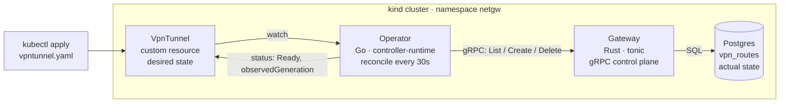

# README — first-screen architecture section (FR-28 draft)

Drop-in for the top of `README.md`. GitHub renders mermaid natively, so there is no image to
generate, commit, or keep in sync.

---

## What this is

A **Kubernetes control plane for VPN tunnels**. You declare a tunnel as a custom resource; a Go
operator makes it true on a Rust gRPC gateway, and keeps it true — including after someone deletes
it behind the operator's back.

The loop is **level-triggered**: the operator does not wait to be told what changed. Every 30
seconds it asks the gateway what actually exists, compares that to what the cluster declares, and
fixes the difference. Delete a route straight out of the database's gateway and it comes back — with
no Kubernetes event involved. That is the whole point, and it is the recording below.

## The five ideas

| Idea | Where it is |
| --- | --- |
| **Level-triggered convergence** | every pass reads actual state fresh and converges from what it finds, not from what it expected |
| **Idempotency** | every RPC is safe to repeat — create upserts, delete succeeds whether or not the row existed |
| **Finalizers** | deleting the resource removes the tunnel *first*, so nothing is ever orphaned |
| **`observedGeneration`** | tells you whether the status you are reading reflects the spec you just edited |
| **Periodic resync** | the only mechanism that can correct drift caused by an actor other than the operator |
